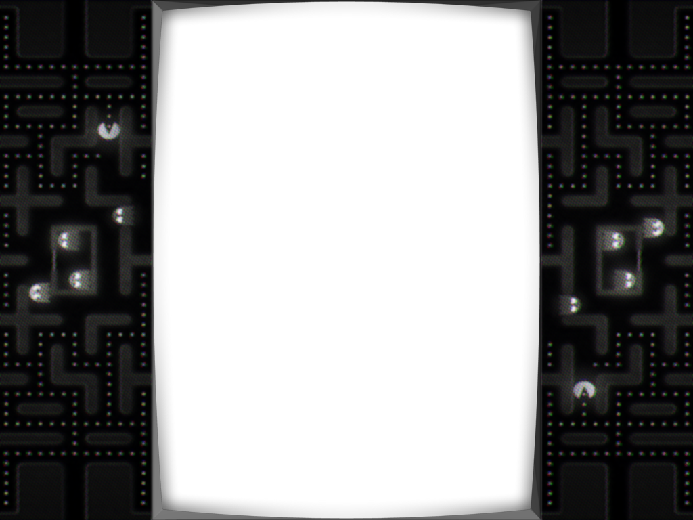

## bezel-images

Bezel images used as overlays across RetroPie on our standard and coin-op systems.

Offsets are ...

**arcadeclassics_4_3_1024_768.png** 
x=225, y=0, width=574, height=768 

**arcadeclassics_16_9_1280_720.png**
- x=370
- y=0
- width=540
- height=720

**arcadeclassics_16_9_1920_1080.png**
- x=555
- y=0
- width=810
- height=1080

**bezel_4_3_1024_768.png**
- x=0
- y=0
- width=1024
- height=768

**bezel_16_9_1280_720.png**
- x=161
- y=0
- width=958
- height=720

**bezel_16_9_1920_1080.png**
- x=242
- y=0
- width=1436
- height=1080
