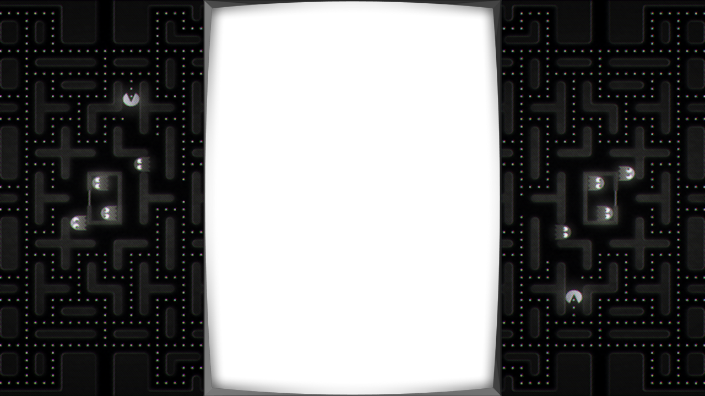

## bezel-images

Bezel images used as overlays across RetroPie on our standard and coin-op systems.

Offsets are ...

**arcadeclassics_4_3_1024_768.png** 
x=225, y=0, width=574, height=768 

**arcadeclassics_16_9_1280_720.png** 
x=370, y=0, width=540, height=720 

**arcadeclassics_16_9_1920_1080.png** 
x=555, y=0, width=810, height=1080 

**bezel_4_3_1024_768.png** 
x=0, y=0, width=1024, height=768 

**bezel_16_9_1280_720.png** 
x=161, y=0, width=958, height=720 

**bezel_16_9_1920_1080.png** 
x=242, y=0, width=1436, height=1080 

**vectrex_4_3_1024_768.png** 
x=279, y=93, width=466, height=576 

**vectrex_16_9_1280_720.png** 
x=420, y=87, width=437, height=541 

**vectrex_16_9_1920_1080.png** 
x=630, y=130, width=656, height=811 

